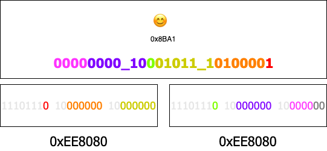

## Encode

例子：

😊 => unicode: 0x8BA1
编码为两个 3 字节 utf8 字符 => 0xee85ac 0xef8780

容器符：

0xEE8080 => 1110111`0`\_10`000000`\_10`000000`

0xEE8080 => 1110111`0`\_10`000000`\_10`000000`

过程：

简单来说就是将一个 4 字节的编码使用两个 3 字节的编码代替存储。
上面的容器符就是用来存储四字节编码的 unicode 编码的一个容器，可以存储 2^26 个字符（unicode 四字节字符大概有 2^16 \* 16 个，所以该编码可以存储所有的四字节字符）。

