<div align=center>

# utf8mb3

 

</div>

Let mysql's utf8 encoding store four-byte characters such as emoji(让 mysql 的 utf8 编码存储表情符号这类的四字节字符).



## Feature

- Four-byte characters to three-byte characters(四字节字符转三字节字符)
- Repeated coding remains unchanged(重复编码内容不变)

## Start

```
npm install utf8mb3
```

## Use

```js
const {
  encodeUtf8mb3,
  decodeUtf8mb3,
  includeEncodeUtf8mb3,
  includeUtf8mb4,
} = require("utf8mb3");

const str = "汉😊😊🛝🛝🛝汉";
// const str = "😊🛝🛝";

console.log(str, str.length);

const utf8mb3 = encodeUtf8mb3(str);

console.log("encodeUtf8mb4", utf8mb3, utf8mb3.length); // encodeUtf8mb4 汉ꂶꂶ鷶鷶鷶汉 12
console.log("decodeUtf8mb4", decodeUtf8mb3(utf8mb3)); // decodeUtf8mb4 汉😊😊🛝🛝🛝汉
console.log("includeEncodeUtf8mb3", includeEncodeUtf8mb3(utf8mb3)); // includeEncodeUtf8mb3 true
console.log("includeUtf8mb4", includeUtf8mb4(str)); // includeUtf8mb4 true
console.log("includeUtf8mb4", includeUtf8mb4("测试")); // includeUtf8mb4 false
```

## License

MIT
