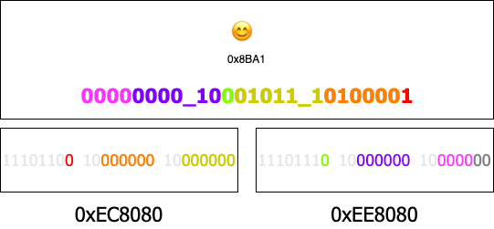

<div align=center>

# utf8mb3

 



</div>

Let mysql's utf8 encoding store four-byte characters such as emoji(让 mysql 的 utf8 编码存储表情符号这类的四字节字符).

## Feature

- Four-byte characters to three-byte characters(四字节字符转三字节字符)
- Repeated coding remains unchanged(重复编码内容不变)
- support wasm module(支持 wasm 使用)

## JS Use

> [Detailed description](./packages/utf8mb3-js/readme.md)
> 支持 nodejs 和 browser 环境

```js
const {
  encode,
  decode,
  includeEncodeUtf8mb3,
  includeUtf8mb4,
} = require("utf8mb3");

const str = "汉😊😊🛝🛝🛝汉";
// const str = "😊🛝🛝";

console.log(str, str.length);

const utf8mb3 = encode(str);

console.log("encodeUtf8mb4", utf8mb3, utf8mb3.length); // encodeUtf8mb4 汉ꂶꂶ鷶鷶鷶汉 12
console.log("decodeUtf8mb4", decode(utf8mb3)); // decodeUtf8mb4 汉😊😊🛝🛝🛝汉
console.log("includeEncodeUtf8mb3", includeEncodeUtf8mb3(utf8mb3)); // includeEncodeUtf8mb3 true
console.log("includeUtf8mb4", includeUtf8mb4(str)); // includeUtf8mb4 true
console.log("includeUtf8mb4", includeUtf8mb4("测试")); // includeUtf8mb4 false
```

## Rust Use

> [Detailed description](./packages/utf8mb3/readme.md)

```rust
let str = "😊";
let result = utf8mb3::encode(str);
println!("encode: {}", result); // encode: 
println!("decode: {}", utf8mb3::decode(&result)); // decode: 😊

```

## WASI Use

...

## Performance

MacOS: 13 , MacBook Pro m1 2021

| Source                | 10000000 😊 coding time | Test Script                                            |
| --------------------- | ---------------------- | ------------------------------------------------------ |
| nodejs native         | 684.573ms              | commemorate/utf8mb3-js/test.js                         |
| rust native           | 61.85475ms             | packages/utf8mb3/src/lib.rs                            |
| wasm run nodejs       | 96.927ms               | packages/utf8mb3-wasm/examples/utf8mb3-js-nodejs-play  |
| wasm run edge browser | 100.6ms                | packages/utf8mb3-wasm/examples/utf8mb3-js-browser-play |
| wasi run wasmedge AOT | 35ms                   |                                                        |
| wasi run warmer       | 60ms                   |                                                        |
| wasi run wasmtime     | 70ms                   |                                                        |

## License

MIT
